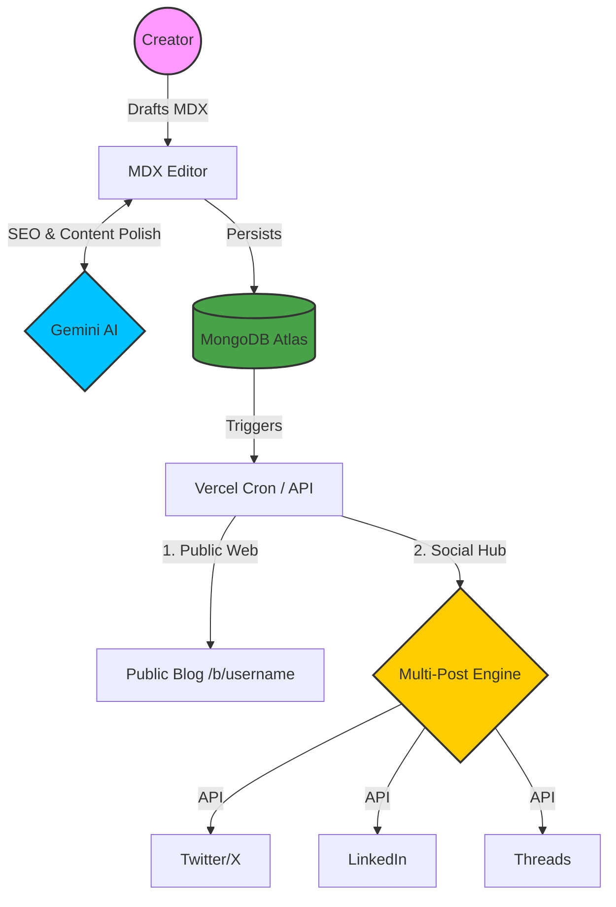

# NexPost - AI-Powered SaaS Content Engine

NexPost is a robust, multi-tenant content engine designed for creators and businesses to build, manage, and scale their digital presence. It combines a powerful headless CMS with advanced AI automation and integrated social media distribution.

## 🚀 Features

- **Multi-Tenant Architecture**: Every user gets a personalized, public-facing blog at `/b/[username]`.
- **MDX Editor**: Professional-grade markdown editor with real-time preview and media management.
- **AI Engine (Gemini)**: Leverage Google Gemini for content generation, SEO optimization, and intelligent writing assistance.
- **Social Auto-Posting**: Automatically share your content to Twitter (X), LinkedIn, and Threads the moment it goes live.
- **Scheduled Publishing**: Set and forget with Vercel Cron-powered scheduling.
- **Analytics Dashboard**: Comprehensive insights into audience engagement and post performance.
- **Secure Authentication**: Robust Google OAuth integration for seamless user onboarding.

## 🛠️ Tech Stack

- **Framework**: Next.js 14 (App Router)
- **Database**: MongoDB (Mongoose)
- **Authentication**: NextAuth.js v5 (Google OAuth)
- **Styling**: Tailwind CSS
- **AI**: Google Gemini Pro
- **Media**: Cloudinary

## 📖 The NexPost Philosophy: "Nex" + "Post"

**NexPost** isn't just another blogging platform; it's a **Next-Generation Distribution Hub**. 

In the modern digital landscape, the biggest challenge for creators isn't just writing—it's **distribution**. Most content dies in obscurity because creators lack the time to manually format and post across multiple social silos. NexPost solves this by making distribution a core part of the creation process. 

**The Mission**: To empower every creator with a "Personal Newsroom" that uses AI to refine thoughts and automation to ensure they reach their audience, wherever they are.

---

## 🏗️ Detailed System Architecture

NexPost is built on a **SaaS-First Architecture**, ensuring scalability and performance:

1.  **Multi-Tenant Engine**: Unlike traditional CMSs, NexPost is designed for thousands of users. It uses a shared MongoDB infrastructure with strict logical isolation, allowing every user to manage their own content, social tokens, and settings independently.
2.  **Dynamic Routing & Public Profiles**: Utilizing Next.js 14 App Router, NexPost dynamically generates public-facing blogs at `/b/[username]`. This provides each creator with a professional, SEO-optimized landing page for their brand.
3.  **Encrypted Token Management**: Social media OAuth tokens are encrypted at rest using AES-256 (via the `TOKEN_ENCRYPTION_KEY`), ensuring that even in the event of a database compromise, user social accounts remain secure.
4.  **The "Intelligence Layer"**: By integrating Google Gemini Pro directly into the editing flow, the platform doesn't just store text—it understands it. It suggests SEO tags, catches tone inconsistencies, and generates social-ready snippets.

---

## 🔄 Illustration: The Content Lifecycle

The following diagram illustrates how a single thought in the NexPost editor becomes a global presence:



## ⚙️ Setup Instructions

### 1. Install Dependencies
```bash
npm install
```

### 2. Environment Variables
Copy the `.env.local.example` to `.env.local` and fill in your keys:
```bash
cp .env.local.example .env.local
```

### 3. Run Development Server
```bash
npm run dev
```
Navigate to `http://localhost:3000`

### 4. Setup Vercel Cron (Production)
The scheduled publisher relies on Vercel Cron. Ensure `vercel.json` is configured:
```json
{
  "crons": [
    {
      "path": "/api/cron/publish",
      "schedule": "* * * * *"
    }
  ]
}
```

## 🔐 Environment Setup Guide

NexPost requires several external services to function correctly. Follow these steps to set up your environment variables.

### 1. Application & Auth
- `NEXT_PUBLIC_APP_URL`: Set to `http://localhost:3000` for local development.
- `AUTH_SECRET`: Used by NextAuth.js to encrypt cookies.
  - Generate one: `openssl rand -base64 32`
- `TOKEN_ENCRYPTION_KEY`: A 32-byte hex string used to encrypt social media OAuth tokens in the database.
  - Generate one: `node -e "console.log(require('crypto').randomBytes(32).toString('hex'))"`

### 2. Database (MongoDB)
1.  Create a free cluster on [MongoDB Atlas](https://www.mongodb.com/cloud/atlas).
2.  Create a database user and password.
3.  Whitelist your IP address (or `0.0.0.0/0` for production).
4.  Copy the connection string and replace `<password>` with your user's password.
- `MONGODB_URI`: `mongodb+srv://<user>:<password>@cluster0.xxx.mongodb.net/nexpost`

### 3. Authentication (Google OAuth)
1.  Go to [Google Cloud Console](https://console.cloud.google.com/).
2.  Create a project and search for **APIs & Services > Credentials**.
3.  Configure the **OAuth Consent Screen**.
4.  Create **OAuth 2.0 Client IDs** (Web Application).
5.  Add Authorized Redirect URI: `http://localhost:3000/api/auth/callback/google`.
- `GOOGLE_CLIENT_ID`: Found in your Google Cloud app credentials.
- `GOOGLE_CLIENT_SECRET`: Found in your Google Cloud app credentials.

### 4. Media Storage (Cloudinary)
1.  Create a free account at [Cloudinary](https://cloudinary.com/).
2.  Navigate to your **Dashboard**.
- `NEXT_PUBLIC_CLOUDINARY_CLOUD_NAME`: Your Cloud Name.
- `CLOUDINARY_API_KEY`: Your API Key.
- `CLOUDINARY_API_SECRET`: Your API Secret.

### 5. AI Features (Google Gemini)
1.  Visit [Google AI Studio](https://aistudio.google.com/).
2.  Create a new API Key for the Gemini API.
- `GEMINI_API_KEY`: Your Gemini API Key.

### 6. Social Media Integration
#### Twitter/X
1.  Apply for a developer account at [X Developer Portal](https://developer.x.com/).
2.  Create a Project and an App.
3.  Enable **User authentication settings**:
    - OAuth 2.0: **On**
    - Type of App: **Web App**
    - Callback URI: `http://localhost:3000/api/social/twitter/callback`
- `TWITTER_CLIENT_ID`: Client ID from your X App.
- `TWITTER_CLIENT_SECRET`: Client Secret from your X App.

#### LinkedIn
1.  Create an app on [LinkedIn Developers](https://www.linkedin.com/developers/).
2.  In the **Products** tab, request "Share on LinkedIn" and "Sign In with LinkedIn".
3.  In **Auth**, add the redirect URI: `http://localhost:3000/api/social/linkedin/callback`.
- `LINKEDIN_CLIENT_ID`: Your LinkedIn Client ID.
- `LINKEDIN_CLIENT_SECRET`: Your LinkedIn Client Secret.

#### Threads (Meta)
1.  Create a "Threads" app on [Meta for Developers](https://developers.facebook.com/).
2.  Add the **Threads API** product.
3.  Add the redirect URI: `http://localhost:3000/api/social/threads/callback`.
- `THREADS_APP_ID`: Your Meta App ID.
- `THREADS_APP_SECRET`: Your Meta App Secret.

### 7. Scheduled Publishing (Vercel Cron)
1.  When deploying to Vercel, the `CRON_SECRET` is automatically verified if set.
2.  Generate a random string for this value.
- `CRON_SECRET`: A secure random string.
